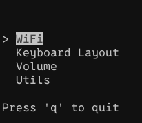
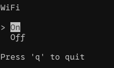
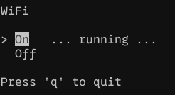

archive. moved to codeberg.

https://codeberg.org/evohunz/picknrun

---

# picknrun

Simple TUI menu picker that run shell commands.

You can use arrow keys or vim's HJKL for navigation.
- Left arrow or `h` goes back a menu level;
- Right arrow, `l` or `enter` goes down a menu level, or executes the command;
- Down arrow or `j` go down;
- Up arrow or `k` go up;
- Use `q` to quit.

# Why?

Because I got too many utility shell files for one-off commands and it gets
messy fast. With this all those one-off commands that I need to run often are
preserved in a centralized place and I can free my brain from having to
remember them all.

# Screenshots





# Config

Configuration is intuitive, lines with a `$ ...` suffix are commands, and lines
without that are menus. Menu options start with a `-` identation. Commands are
blocking, suffix it with `&` to spawn a sub shell to run it. There is absolutely
no handling of stdout/stderr/stdin, error conditions, or whatever. This is dead
simple. If a command is not working, try it yourself on a dedicated terminal,
this is a menu to run stupid simple commands, not a debug tool. Excess
whitespace is trimmed off.

Sample config:

```
WiFi
- On   $ nmcli d up wlp0s20f3
- Off  $ nmcli d down wlp0s20f3

Keyboard Layout
- US          $ xkb-switch -s 'us'
- US (intl)   $ xkb-switch -s 'us(intl)'

Volume
- Controls      $ pavucontrol &
- Up            $ wpctl set-volume @DEFAULT_SINK@ 3%+ -l 1.0
- Down          $ wpctl set-volume @DEFAULT_SINK@ 3%- -l 1.0
- Toggle Mute   $ wpctl set-mute @DEFAULT_SINK@ toggle

Apps
- Input-Leap    $ input-leap &
- Games
- - Steam  $ steam &
- - BAR    $ ~/projects/utils/exec_on_nvidia.sh ~/AppImages/Beyond-All-Reason-1.2988.0.AppImage &
```

You may also check [options.pnr](options.pnr), this is the real config I use
daily.

# Command line options

```sh
$ ./picknrun -h
Usage:

  ./picknrun [--help|-h] [--file|-f <options.pnr>] [--white|-w]

Options:

  --help, -h
    Display this message.

  --file, -f
    Set the file with options to load.
    Defaults to "options.pnr".

  --white, -w
    Signal this is running on a terminal with a light background,
    highlight colors will be inverted.
```

# License

Copyright (C) 2026 Thiago Negri

This program is free software: you can redistribute it and/or modify it under
the terms of the GNU General Public License as published by the Free Software
Foundation, either version 3 of the License, or (at your option) any later
version.

This program is distributed in the hope that it will be useful, but WITHOUT ANY
WARRANTY; without even the implied warranty of MERCHANTABILITY or FITNESS FOR A
PARTICULAR PURPOSE. See the GNU General Public License for more details.

You should have received a copy of the GNU General Public License along with
this program. If not, see <https://www.gnu.org/licenses/>.

Check [LICENSE](LICENSE) for a copy of the full GPLv3 license.
